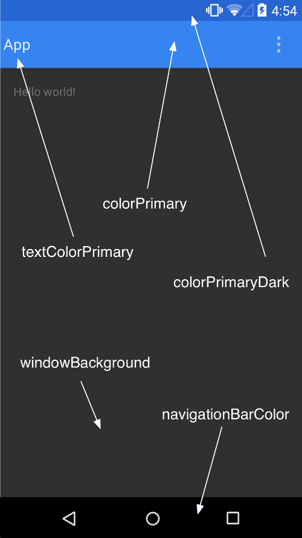

# Main Layout

- Status bar (from Android); BackgroundColor: colorPrimaryDark
- Toolbar
- Content?
- Tabbar (optional) or NavigationBar (older Android OS)

# Storage

- Storage Access Framework (SFA) (from Android 4.4)
- Media Storage APIs
- Scoped Storage (from Android 10)
